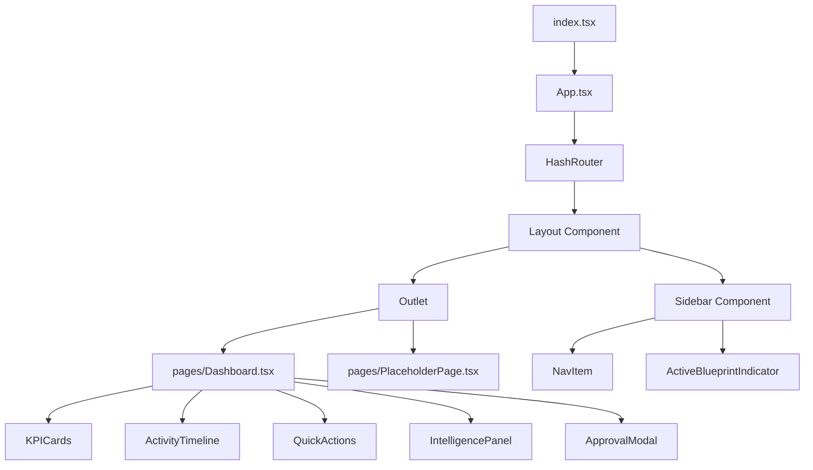
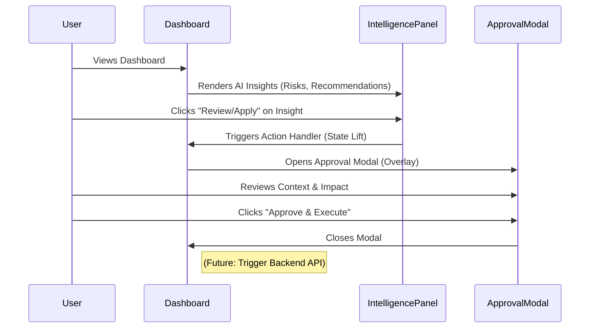

# Application Overview

## Tech Stack & Versions
- **Core Framework:** React v19.2.3
- **Routing:** React Router DOM v7.11.0
- **Language:** TypeScript (TSX)
- **Styling:** Tailwind CSS (via CDN script with custom config)
- **Icons:** Lucide React v0.562.0
- **Fonts:** Inter (Sans), Playfair Display (Serif)
- **Environment:** Browser-native ES Modules (via `esm.sh` importmap)

## Directory Structure
```text
/
├── index.html          # Entry point, importmap, global styles, font links
├── index.tsx           # React Root mount
├── App.tsx             # Main Router, Layout, Sidebar, and Routing Logic
├── types.ts            # Shared TypeScript interfaces (KPI, ActivityItem, etc.)
├── metadata.json       # Application metadata and permissions
├── pages/
│   ├── Dashboard.tsx       # Main command center logic & UI
│   └── PlaceholderPage.tsx # Generic view component for CRM, Projects, Tasks
└── docs/
    └── 01-overview.md  # This documentation
```

## Routing & Sitemap

The application uses `HashRouter` for client-side routing.

| Path | Component | Description |
|------|-----------|-------------|
| `/` | `Dashboard` | Redirects/Renders Dashboard by default |
| `/dashboard` | `Dashboard` | Main Command Center (KPIs, Timeline, Intelligence) |
| `/crm/contacts` | `PlaceholderPage` | CRM View (type: 'crm') |
| `/projects` | `PlaceholderPage` | Projects List (type: 'projects') |
| `/projects/:id` | `PlaceholderPage` | Project Details (type: 'project-detail') |
| `/tasks` | `PlaceholderPage` | Task List (type: 'tasks') |

## Component Architecture

### Component Hierarchy


### Dashboard Interaction Flow
The core UX pattern "AI proposes, Humans approve" is implemented here.



## Workflows & Features

### 1. Main Dashboard (`/dashboard`)
*   **3-Panel Layout:**
    *   **Left (Nav):** Navigation and Active Blueprint context.
    *   **Center (Canvas):** KPIs, Activity Timeline, Quick Actions, Velocity Charts.
    *   **Right (Intelligence):** Read-only stream of AI insights.
*   **Intelligence Workflow:** The right panel offers insights. Clicking an action button opens a modal in the center screen, ensuring focus on the decision.
*   **Visual Style:** "Editorial Luxury" – Minimal shadows, Serif headers, 8px grid, grayscale palette with Orange accents.

### 2. Secondary Pages (Placeholders)
*   **Unified Component:** `PlaceholderPage.tsx` handles rendering for CRM, Projects, and Tasks to ensure consistent layout while prototyping.
*   **Context Intelligence:** The right panel in these views adapts to show mocked insights relevant to the specific page type (e.g., "Contact Insights" for CRM).

## Code Analysis & Best Practices

### Strengths
*   **Separation of Concerns:** `Layout` handles the persistent UI (Sidebar), while `Outlet` manages page content.
*   **Design Tokens:** Colors and fonts are configured in the Tailwind config within `index.html`, allowing `text-sun-900` or `font-serif` utility usage.
*   **Type Safety:** `types.ts` is used to define shapes for data like `IntelligenceInsight`, ensuring contract validity between components.
*   **UX Patterns:** The application strictly adheres to the "No Black Box" rule by explaining "Why" and "Impact" in every AI suggestion.

### Areas for Expansion
*   **Data Layer:** Currently uses hardcoded mock data arrays. Future iterations will need a Context API or State Management library (Zustand/Redux) to share Blueprint state across routes.
*   **Routing:** React Router v7 is installed. Currently using basic Route definitions; could be upgraded to Data Routers (`createHashRouter`) for better loader/action support in the future.
*   **Responsiveness:** The current layout enforces a `min-w-[800px]` on the main panel, optimized for Desktop/Tablet. Mobile responsiveness would require a collapsible sidebar and intelligence panel.
