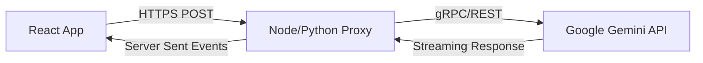

# 🚀 Sun AI Production Guide: Backend Integration

This guide details how to replace the simulated mock services with real Gemini 3 API calls via a backend proxy.

## Architecture

To protect your Gemini API Key and maintain the "System Blueprint" logic securely, we recommend a Proxy Architecture.



---

## 1. Backend Service Definition

You need two primary endpoints to support the current features.

### Endpoint A: `/api/agent/planner`
**Purpose:** Generates the Project Plan (Steps 5-6 of Wizard).
**Model:** `gemini-3-pro-preview`
**Config:** `thinkingConfig: { budget: 4000 }`

**Request Payload:**
```json
{
  "goal": "Launch MVP for FinTech App",
  "deadline": "2024-12-01",
  "constraints": { "budget": 50000, "urgency": "High" }
}
```

**Response Schema (Use `responseSchema` in API call):**
```typescript
interface ProjectPlanResponse {
  phases: {
    title: string;
    tasks: { title: string; duration: string; role: string }[]
  }[]
}
```

### Endpoint B: `/api/agent/enrich`
**Purpose:** Enriches Contact/Project data (The Researcher Agent).
**Model:** `gemini-3-flash-preview`
**Config:** `tools: [{googleSearch: {}}]`

---

## 2. Frontend Service Layer Update

Replace `services/plannerAgent.ts` with this real implementation.

```typescript
// services/api.ts

const API_URL = process.env.REACT_APP_API_URL || 'http://localhost:3000';

export const generateProjectPlan = async (goal: string, deadline: string, onThought: (t: string) => void) => {
  // 1. Simulate "Thinking" locally while waiting for server (or use SSE for real server thoughts)
  const thinkInterval = setInterval(() => {
    onThought("Optimizing resources...");
  }, 1000);

  try {
    const response = await fetch(`${API_URL}/api/agent/planner`, {
      method: 'POST',
      headers: { 'Content-Type': 'application/json' },
      body: JSON.stringify({ goal, deadline })
    });

    if (!response.ok) throw new Error('Agent Failed');
    
    const data = await response.json();
    return data;
  } finally {
    clearInterval(thinkInterval);
  }
};
```

## 3. Deployment Checklist

1.  **Environment Variables:**
    *   Set `REACT_APP_API_URL` in your production build pipeline (Vercel/Netlify).
2.  **CORS:**
    *   Ensure your backend permits requests from your frontend domain.
3.  **Persistence:**
    *   The current `localStorage` solution works well for drafts. For production team collaboration, replace `services/storage.ts` with calls to a database (PostgreSQL/Supabase) to save drafts remotely.

## 4. Gemini 3 Configuration Tips

When configuring the model on the backend:

*   **Temperature:** Set to `0.2` for the Planner. You want consistent, structured plans, not creative fiction.
*   **System Instruction:**
    > "You are an expert Project Manager. You create detailed, realistic Work Breakdown Structures. You always account for QA and Deployment phases."

## 5. Future Enhancements

*   **Streaming Thoughts:** Instead of local simulation, use Server-Sent Events (SSE) to stream the actual "Thinking" tokens from Gemini 3 Pro to the `StepArchitecting` component.
*   **Multi-Turn Refinement:** Allow the user to "Chat" with the plan in Step 6 to refine it (e.g., "Remove the marketing phase") before approving.
