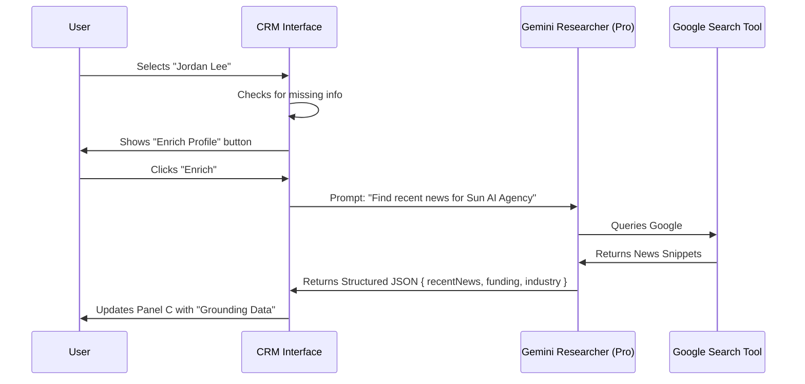
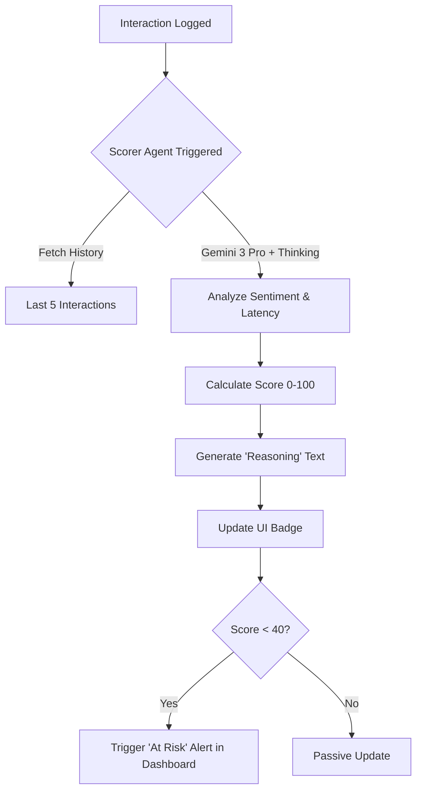

# CRM Module: Relationship Intelligence

**Route:** `/crm/contacts`
**Theme:** "From Database to Orchestration"

## 1. System Architecture

The CRM is built on a 3-Panel "Sun AI" layout driven by specialized agents.

### Agent Configuration (Gemini 3 Stack)

| Agent Archetype | Model | Config | Responsibility |
| :--- | :--- | :--- | :--- |
| **The Scorer** | `gemini-3-pro-preview` | `thinkingConfig` enabled | Analyzes interaction history to determine "Relationship Strength" (0-100) and "Churn Risk". |
| **The Researcher** | `gemini-3-pro-preview` | `tools: [{googleSearch: {}}]` | Enriches contact profiles with real-time news, funding rounds, and recent LinkedIn activity. |
| **The Comms Lead** | `gemini-3-flash-preview` | Temperature: 0.7 | Drafts personalized follow-up emails based on specific context triggers. |
| **The Controller** | **Human UI** | N/A | The "Approve/Reject" gate. AI never sends emails or changes deal stages automatically; it puts them in a "Proposed" state. |

## 2. Data & State Logic

### Core Entities
```typescript
interface Contact {
  id: string;
  name: string;
  role: string;
  company: string;
  blueprintId?: string; // Link to the "Master Plan"
  lastInteraction: Date;
  sentimentScore: number; // 0-100, calculated by The Scorer
  status: 'active' | 'nurture' | 'risk';
  aiSummary?: string; // One-line context summary
}

interface Interaction {
  id: string;
  type: 'email' | 'call' | 'meeting';
  notes: string;
  date: string;
}
```

## 3. UI/UX Layout Specifications

### Panel A: Navigation & Context (256px)
*   **Filters:** "VIP", "Recent", "At Risk" (Calculated by Scorer).
*   **Company List:** Group contacts by organization.

### Panel B: The Work Surface (Fluid)
*   **Editorial Table:** 
    *   Custom headers with serif font.
    *   Columns: Name, Company, Role, Blueprint Link, Status Badge.
    *   **Interaction:** Clicking a row sets `activeContactId`.
*   **Visuals:** 
    *   Minimal clutter. 
    *   Status badges use subtle pastels (bg-green-50 text-green-700), not neon.

### Panel C: Intelligence & Actions (320px)
This panel transforms based on the selection in Panel B.

#### State 1: No Selection (Aggregate View)
*   **Pipeline Health:** "3 Deals closing this week."
*   **Urgent Actions:** "2 VIPs ignored for >14 days."

#### State 2: Active Contact (Detail View)
*   **Profile Header:** Avatar + Name + LinkedIn Link.
*   **AI Insight Card:** 
    *   "Relationship Strength: 85/100" (Visual Bar).
    *   "Why: Last meeting was positive, but no follow-up scheduled."
*   **Suggested Actions:**
    *   [Draft Follow-up] -> Triggers **The Comms Lead**.
    *   [Enrich Profile] -> Triggers **The Researcher**.

## 4. Implementation Plan (Multistep Prompts)

Copy and paste these prompts sequentially to build the module.

### Phase 1: The UI Skeleton
> **Prompt:** 
> "Create the `CRMContacts` page layout at `/crm/contacts`.
> 1. Use the standard 3-panel layout.
> 2. **Left Panel:** Add a navigation list for 'All Contacts', 'VIP', and 'Archived'.
> 3. **Main Panel:** Create an editorial-style table listing contacts. Use the mock data provided below. Columns: Name, Role, Company, Blueprint (as a link), Status.
> 4. **Right Panel:** Create a `ContactIntelligence` component. For now, it should just display the details of the contact selected in the Main Panel. If no contact is selected, show a 'Select a contact to view intelligence' empty state.
> 5. Use `lucide-react` for icons. Style with Tailwind, adhering to the 'Editorial Luxury' guide (serif headers, slate-900 text, slate-200 borders)."

### Phase 2: The Researcher (Google Grounding)
> **Prompt:** 
> "Implement the 'Enrich Contact' feature in the Right Panel.
> 1. Add a button 'Auto-Enrich Profile' when a contact is selected.
> 2. Create a mock function `enrichContact(companyName)` that simulates calling `gemini-3-pro-preview` with `googleSearch` tools.
> 3. **UI Behavior:** When clicked, show a 'Researching...' state (subtle pulse, no spinners).
> 4. **Result:** Display a card showing 'Latest Company News' and 'Industry' extracted from the mock AI response.
> 5. **Constraint:** The UI must state 'AI Sources: Google Search' to avoid black-box feeling."

### Phase 3: The Scorer (Thinking Config)
> **Prompt:** 
> "Implement the 'Relationship Score' visualization in the Right Panel.
> 1. Visually display a score (0-100) with a color-coded progress bar (Green/Orange/Red).
> 2. Display the 'Why' analysis below it.
> 3. **Simulation:** Mock the backend call to `gemini-3-pro-preview` using `thinkingConfig`. The model would hypothetically analyze the last 5 emails to determine sentiment.
> 4. **Output:** Show a sample insight like: 'Score: 72. Trending Down. Reason: Client expressed concern about timeline in last email (2 days ago).'"

### Phase 4: The Comms Lead (Drafting Agent)
> **Prompt:** 
> "Implement the 'Draft Follow-up' workflow.
> 1. In the Right Panel, under 'Next Best Action', add a 'Draft Reassurance Email' button.
> 2. **Action:** Clicking this opens a modal overlay (The Controller Gate).
> 3. **Modal Content:**
>    - Left side: The Context (Last interaction notes).
>    - Right side: The Draft (Generated by `gemini-3-flash-preview`).
> 4. **Controls:** 'Regenerate', 'Edit', and 'Approve & Send'.
> 5. **UX:** The user must feel they are approving a proposal, not that the AI sent it automatically."

### Phase 5: Pipeline Integration
> **Prompt:** 
> "Connect the CRM to the Blueprint system.
> 1. In the Main Panel table, make the 'Blueprint' column clickable.
> 2. When clicked, it should navigate to `/dashboard` but pass a state to highlight the relevant active blueprint.
> 3. Add a visual indicator in the CRM table if the linked Blueprint is 'At Risk' (syncing status from the Dashboard KPIs)."

## 5. Workflow Diagrams

### Enrichment Flow (The Researcher)


### Scoring Logic (The Scorer)

