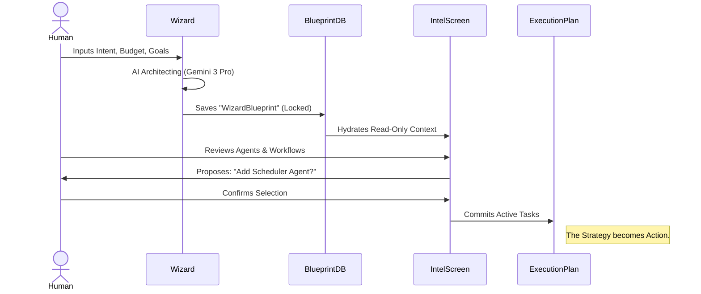

# 🗺️ Sitemap & Routing Architecture

**Version:** 2.0
**Architect:** Principal Product Architect
**System:** Sun AI Agency

This document outlines the routing structure for the entire platform, separating the **Public Marketing Site** from the **Authenticated Web Application**.

---

## 1. Updated Sitemap (Tree Structure)

```text
root/
├── (Public Website)
│   ├── /                   # Landing Page (Value Prop)
│   ├── /features           # "AI OS" Deep Dive
│   ├── /pricing            # Agency Tiers
│   ├── /about              # Philosophy
│   ├── /login              # Auth Entry
│   └── /signup             # Registration
│
└── (Authenticated App)
    ├── /dashboard          # Main Command Center
    ├── /tasks              # Global Task Inbox
    ├── /crm                # Relationship Intelligence
    │   └── /contacts       # Contact List
    │
    ├── /wizard             # Project Kickoff (Modal/Fullscreen)
    │   ├── /basics         # Step 1
    │   ├── /intent         # Step 2
    │   ├── /constraints    # Step 3
    │   ├── /architecting   # Step 4 (AI Processing)
    │   └── /proposal       # Step 5 (Commit Gate)
    │
    ├── /projects           # Portfolio View
    │   ├── /:projectId     # Project Container
    │   │   ├── /overview       # Dashboard & KPIs
    │   │   ├── /intelligence   # AI Analysis (The "Brain")
    │   │   ├── /plan           # Execution Plan (The "WBS")
    │   │   ├── /files          # Documents
    │   │   └── /settings       # Team & Config
    │   │
    │   └── /new            # Redirects to /wizard
    │
    └── /settings           # Org Settings
```

---

## 2. Routing Table

| Area | Route | Auth | Purpose |
| :--- | :--- | :--- | :--- |
| **Public** | `/` | No | Marketing conversion funnel. |
| **Public** | `/login` | No | Authentication entry point. |
| **App** | `/dashboard` | **Yes** | High-level summary of all active blueprints and risks. |
| **App** | `/crm/contacts` | **Yes** | Relationship management and enrichment. |
| **App** | `/projects` | **Yes** | Grid view of all projects with status indicators. |
| **Project** | `/projects/:id` | **Yes** | Specific project hub. Defaults to `overview`. |
| **Project** | `/projects/:id/intelligence` | **Yes** | **AI Decision Support.** Interprets Blueprint, suggests Agents/Workflows. |
| **Project** | `/projects/:id/plan` | **Yes** | **Execution.** The committed Gantt/List view of tasks. |
| **Wizard** | `/wizard` | **Yes** | Full-screen experience for creating new blueprints. |

---

## 3. Wizard Routing

The Wizard is a stateful, linear flow. It should likely be implemented as a single route (`/wizard`) with internal state management, or sub-routes if deep-linking to a step is required.

*   **Entry:** `/wizard` (Resets state or loads draft)
*   **Steps:** Internal State `step: 1 | 2 | 3 ...`
*   **Processing:** `state: 'architecting'` (Locks UI, streams AI tokens)
*   **Exit:**
    1.  **Success:** Redirects to `/projects/:newId/intelligence` (To review AI suggestions)
    2.  **Cancel:** Redirects to `/projects`

---

## 4. Dashboard & Project Routing Logic

The Project structure is designed to separate **Strategy (Intelligence)** from **Execution (Plan)**.

*   **Project Intelligence (`/projects/:id/intelligence`)**
    *   *State:* Read-only view of the Blueprint.
    *   *Action:* User selects Agents/Automations.
    *   *Outcome:* "Commit" button pushes items to the Execution Plan.
*   **Execution Plan (`/projects/:id/plan`)**
    *   *State:* Mutable list of Tasks and Active Agents.
    *   *Action:* User assigns teams, marks complete.
    *   *Outcome:* Updates Project Progress %.

---

## 5. User Journey Table

| Journey | Actor | Screens Flow (Sequential) | Outcome |
| :--- | :--- | :--- | :--- |
| **New Project** | Founder | 1. `/dashboard` (Click New)<br>2. `/wizard` (Inputs)<br>3. `/wizard` (AI Architecting)<br>4. `/projects/:id/intelligence` | A new System Blueprint is created and analyzed. |
| **Execution** | PM | 1. `/projects/:id/intelligence` (Review Recs)<br>2. `[Confirm]`<br>3. `/projects/:id/plan` (View WBS)<br>4. `/tasks` (Assign) | AI suggestions are converted into real work tasks. |
| **Risk Check** | Ops | 1. `/dashboard` (See Risk Alert)<br>2. `/projects/:id/overview`<br>3. `/projects/:id/plan` (Adjust Timeline) | Project is brought back on track. |

---

## 6. Mermaid Diagram — Sitemap

```mermaid
graph TD
    subgraph Public Website
    Home[/]
    Login[/login]
    end

    subgraph App
    Dash[/dashboard]
    CRM[/crm/contacts]
    Projects[/projects]
    GlobalTasks[/tasks]
    end

    subgraph Project Context
    Overview[/:id/overview]
    Intel[/:id/intelligence]
    Plan[/:id/plan]
    end

    subgraph Wizard Flow
    W_Start[/wizard]
    W_Process{AI Architecting}
    W_Review[/wizard/proposal]
    end

    Home --> Login
    Login --> Dash
    
    Dash --> Projects
    Dash --> CRM
    
    Projects --> Overview
    Projects --> W_Start
    
    W_Start --> W_Process
    W_Process --> W_Review
    W_Review --> Intel
    
    Overview --> Intel
    Overview --> Plan
    Intel -->|Commit Items| Plan
```

---

## 7. Mermaid Diagram — Core Flow (The "Sun" Loop)

This diagram illustrates the "AI Proposes, Human Approves" architecture.


